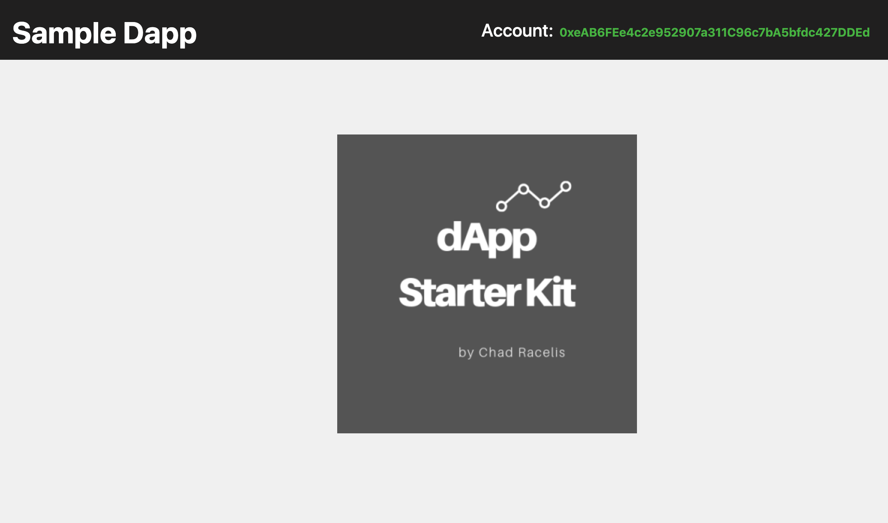
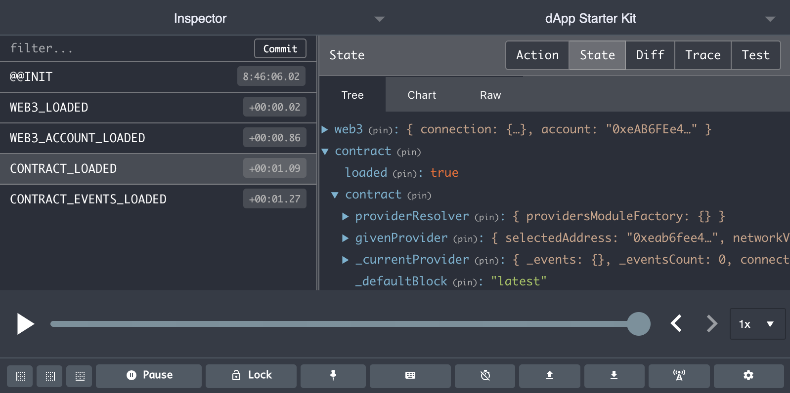
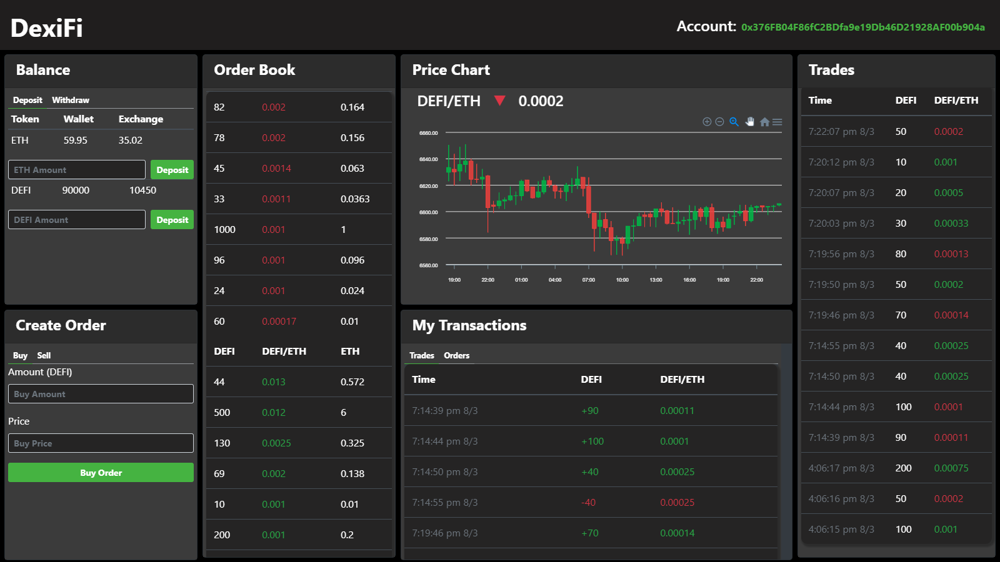

<h1>DApp Starter Kit for Ethereum</h2> 

<h2>
  Packed with React, Redux, Bootstrap, Truffle and Web3, dApp Starter Kit allows you to instantly start building your user-interface with   your smart   contracts. All the hassle of configurating Web3, account and even smart contracts are already preloaded for you on the       front end via Redux, making it easy to dive straight to the code of your contracts into your UI. This kit is also bundled with Redux   Dev Tools, Lodash and Reselect helping you manage your smart contract data and scale your application.
</h2>

<h3> Getting Started </h3>

Make sure you have the following dependencies downloaded to ensure everything works properly without any issues

Global dependencies -  
•	Node @9.10.0  
•	Python @2.7.7  
•	Node-gyp @3.6.2  
•	Truffle ^5.0.5  

Tools -  
•	Ganache  
•	Metamask Extension for Google Chrome  
•	Redux devtools extension  

Keep note -   
•	Once you compile your contracts, your artifacts will be stored under 'src/abis' so it is easier to invoke at the redux store 

Learning Resources -  
•	Web3 - https://web3js.readthedocs.io/en/v1.2.0/web3-eth.html  
• Solidity - https://solidity.readthedocs.io/en/v0.5.11/  
•	Truffle - https://www.trufflesuite.com/docs/truffle/overview  
• React - https://reactjs.org/docs/getting-started.html  
• Redux - https://devdocs.io/redux/  
• Reselect - https://github.com/reduxjs/reselect  
•	Lodash - https://lodash.com/docs/  
•	Bootstrap - https://getbootstrap.com/docs/4.3/getting-started/introduction/  

<strong>1.</strong> Start by cloning this repo  
<strong>2.</strong> Inside the new folder, npm install to install all req'd dependencies  
<strong>3.</strong> Open up Ganache and click 'Quick Start'  
<strong>4.</strong> Under src/contracts folder, replace 'SampleContract' with your own Smart Contract.  
<strong>5.</strong> Modify your migrations under migrations/2_deploy_contract relevant to your new smart contract  
<strong>6.</strong> With your folder as the directory, go to your terminal and type, '<strong>truffle compile</strong>' to compile your contracts  
<strong>7.</strong> Then migrate your contracts to deploy to your local blockchain aka ganache - '<strong>truffle migrate</strong>'.  
<strong>8.</strong> Go to src/store/interactions file and repace 'SampleContract' with your contract name which is imported @ line 21 and used at line 41  
<strong>9.</strong> Under the same directory, If you have events in your smart contract, modify the function 'loadContractEvents' under line 51 relevant to your smart contract. You can use the same practice of this function to invoke other methods of your smart contract. Seek web3 docs to learn more  
<strong>10.</strong> Go to your metamask extension and create a new network configured to your Ganache network. In that network, import a new account w/ one of the private keys inside your Ganache.  
<strong>11.</strong> '<strong>npm start</strong>' to load up the new Dapp Starter Kit on your local browser. (make sure you're on your ganache network in your metamask extension)  
<strong>12.</strong> Upon start, you should see your metamask account loaded on your navbar as well as your web3, account and contract loaded in the Redux Dev Tools Extension via Redux.  

 Stay tuned as I will continue to add features to this dapp starter kit such as fetching and displaying methods with the 'Sample Contract' into the user interface.  

  

  Project Example using this starter kit -> https://github.com/chadracelis/Decentralized-Exchange  
  

  
